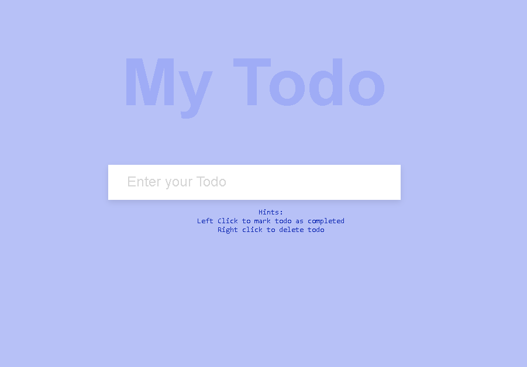

# ToDo App

A simple and elegant ToDo application built with vanilla JavaScript, HTML, and CSS.

## Features

- **Add Todos:** Quickly add new tasks to your list.
- **Mark as Completed:** Click on a todo to mark it as completed (strikethrough effect).
- **Delete Todos:** Right-click on a todo to remove it from the list.
- **Persistent Storage:** Todos are saved in your browser's local storage, so your list stays even after refreshing the page.

## Usage

1. **Clone or Download** this repository.
2. Open `index.html` in your web browser.
3. Enter your tasks in the input field and press Enter to add them.
4. Click on a todo to mark it as completed.
5. Right-click on a todo to delete it.

## File Structure

- [`index.html`](index.html): Main HTML file.
- [`style.css`](style.css): Styles for the app.
- [`script.js`](script.js): JavaScript logic for managing todos.

## Hints

- **Left Click:** Mark todo as completed.
- **Right Click:** Delete todo.

## Screenshot

## License

This project is open source
